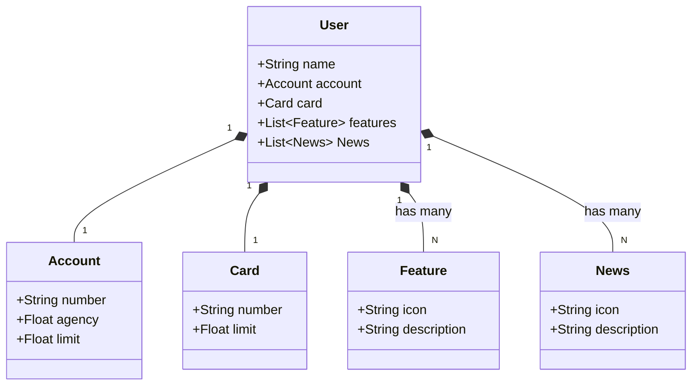

# Claro Java com Spring Boot - Bootcamp 2024

## Diagrama de Classes

```mermaid
classDiagram
    class User {
        +String name
        +Account account
        +Card card
        +List~Feature~ features
        +List~News~ News
    }

    class Account {
        +String number
        +Float agency
        +Float limit
    }

    class Feature {
        +String icon
        +String description
    }

    class Card {
        +String number
        +Float limit
    }

    class News {
        +String icon
        +String description
    }

    User "1" *-- "1"Account
    User "1" *-- "1" Card
    User "1" *-- "N" Feature : has many
    User "1" *-- "N" News : has many
```
